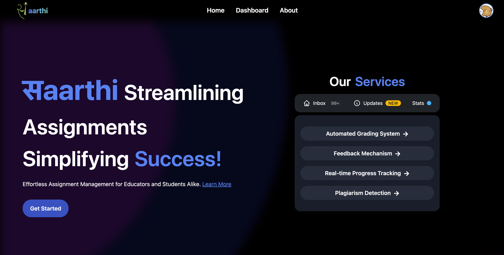
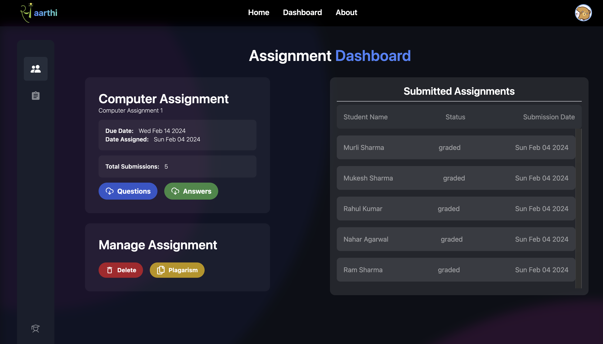
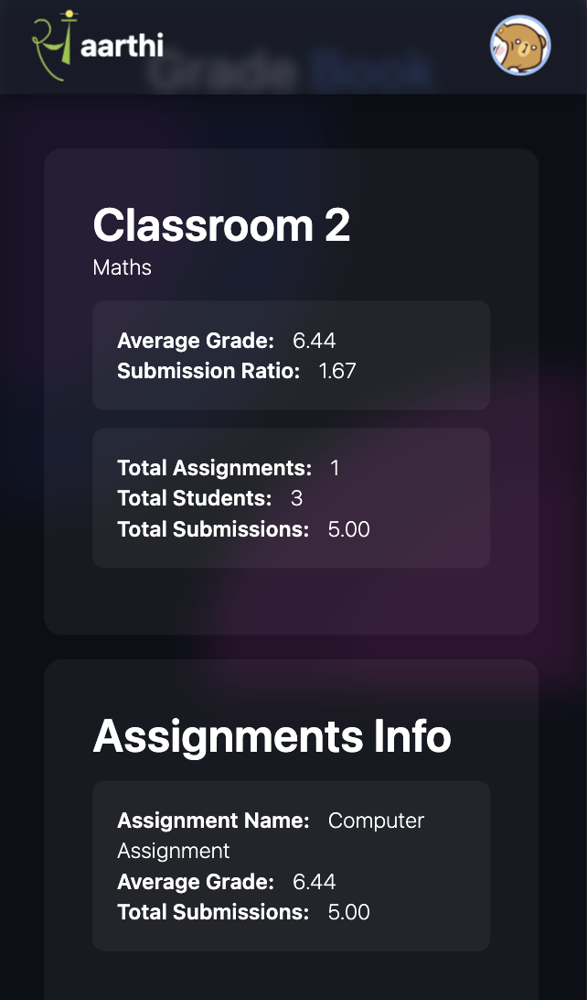
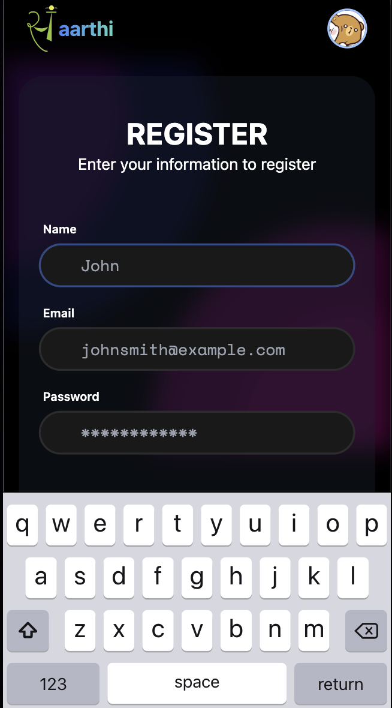

# Saarthi 🚀

Saarthi is an innovative educational platform designed to provide a seamless and enhanced experience for both educators and students. Empowering education through cutting-edge features and user-friendly design.

## Features 🌟

- **Beautiful and Easy-to-Use UI** 💎: Enjoy a visually appealing and intuitive user interface for a delightful experience.

- **OCR (Optical Character Recognition)** 🔍: Easily extract text information from images, making content digitization a breeze.

- **Grade Checking** 📊: Effortlessly check and manage grades with a comprehensive grading system.

- **Feedback Mechanism** 📝: Facilitate communication and improvement with a built-in feedback system.

- **Real-Time Tracking** 🕒: Stay updated with real-time tracking of student progress and activities.

- **Gradebook Management** 📚: Organize and manage grades efficiently with the integrated gradebook.

- **Plagiarism Detection** 🚫: Ensure academic integrity with both online and intra-class plagiarism detection.

- **Classroom Management** 🎓: Effectively manage classrooms for a smooth teaching and learning experience.

- **Individual Management** 👤: Tailor education to individual needs with personalized student management.

- **Raise Dispute** ❗: Address concerns and disputes through a simplified and streamlined dispute resolution process.

## UI
### Desktop Landing Page


### Assignment Dashboard


### Mobile Views
<div style="display: flex; justify-content: space-between;">
   
   
   
</div>

### Tech Stack
- **MERN**
- **TypeScript**
- **Flask**
- **Pytorch/ Tensorflow**
- **HuggingFace Transformers**

## Getting Started

To run the application locally, follow these steps:

1. Clone the repository:
   ```bash
   git clone https://github.com/whysosaket/saarthi.git
   ```

2. Navigate to the project directory:
   ```bash
   cd saarthi
   ```

3. Install dependencies for both frontend and backend:
   ```bash
   cd client
   npm install

   cd ../server
   npm install
   ```

4. Set up environment variables:
   - Create a `.env` file in the backend directory.
   - Add necessary environment variables (e.g., MongoDB URI, JWT secret, etc.).

5. Start the development server for both frontend and backend:
   ```bash
   cd client
   npm run dev

   cd ../server
   npm run dev
   ```

6. Access the application in your browser at `http://localhost:5173`.

---

Feel free to customize and expand upon this README as needed for your project documentation. If you have any specific requirements or questions, let me know!
